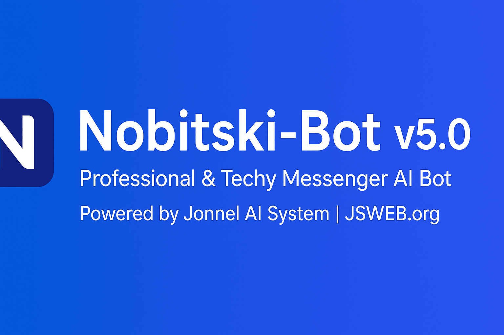

  

  

  <b>Nobitski-Bot v5</b> 
  Professional & Techy Messenger AI Bot powered by <a href="https://jsweb.org">Jonnel AI System</a>

  <b>Owner & Contact Information</b>  
  <table>
    <tr>
      <td>Facebook</td>
      <td><a href="https://www.facebook.com/share/17J36r4cGj/">Click Here</a></td>
    </tr>
    <tr>
      <td>Gmail</td>
      <td>jswebsolutionsph@gmail.com</td>
    </tr>
    <tr>
      <td>GitHub</td>
      <td><a href="https://github.com/CHINK-JSWEB">CHINK-JSWEB</a></td>
    </tr>
  </table>

  <b>Getting Started</b>  
  <b>Install Dependencies:</b>
  <pre>npm install</pre>
  <b>Run the Application:</b>
  <pre>node index.js</pre>

  <b>AppState Setup Tutorial</b>
  <ol>
    <li>Download <b>FIREFOX</b> or <b>KIWI Browser</b></li>
    <li>Install <a href="https://cookie-editor.com/">Cookie Editor</a> or <a href="https://addons.mozilla.org/en-US/firefox/addon/fb-auth-cookie/">FB Auth Cookie</a></li>
    <li>Login your BOT account on Facebook</li>
    <li>Tap the puzzle icon → Click <b>C3c Fbstate</b></li>
    <li>Export Fbstate → Copy to clipboard</li>
    <li>Add your appState in <b>appState.json</b></li>
  </ol>
  <b>Tutorial Video:</b> Soon - I'll Upload it. 

  <b>Core Features</b>
  <ul>
    <li>Spotify-style Music Download</li>
    <li>UUIDv4 Generator (local & API)</li>
    <li>TinyURL Shortener</li>
    <li>Spam Messaging</li>
    <li>Auto Cleaner (Logs, Cache, Temp)</li>
    <li>More advanced AI commands</li>
  </ul>
  <i>Code Debugging handled by ChatGPT</i>

  <b>Sources & Libraries</b>
  <ul>
    <li>Bot Creator: Jonnel Soriano</li>
    <li>FCA Library: ws3-fca</li>
    <li>Free API:
      <ul>
        <li><a href="https://haji-mix-api.gleeze.com">Haji Mix API</a></li>
        <li><a href="https://betadash-api-swordslush-production.up.railway.app">BetaDash API</a></li>
        <li>and more...</li>
      </ul>
    </li>
    <li>Node.js, NPM, ffmpeg, ytdl-core, scrape-yt, express, mathjs</li>
  </ul>

  <b>Made with ❤️ and 💻 by Jonnel Soriano</b>

